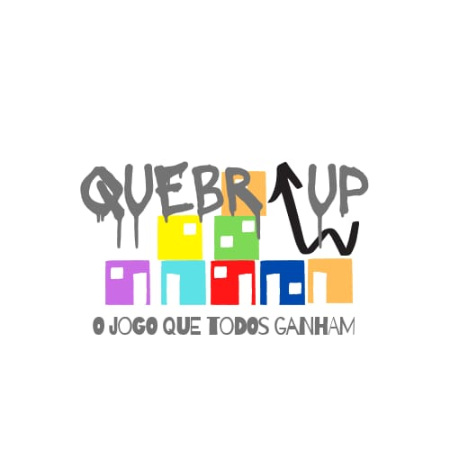
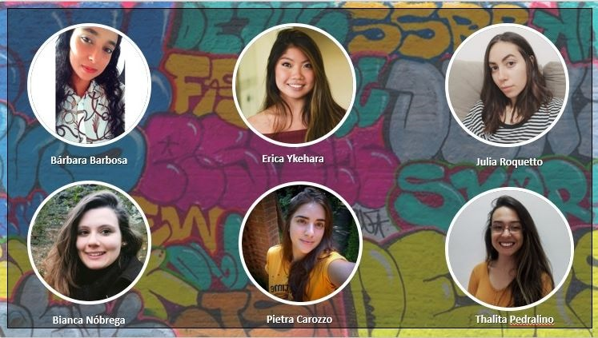

# Hackathon-CCR
 

  

Projeto desenvolvido para o Hackathon CCR - Shawee. .
    

Baixar Visual Code [VScode](https://reactjs.org/).

# Conheça nosso Time ! 
    
 

  <a href="https://github.com/barbara-barbosa/Hackathon-CCR">
    

# Contato 

- Bárbara Barbosa [Linkedin](https://www.linkedin.com/in/b%C3%A1rbara-barbosa-/)
- Bianca Nobrega - [Linkedin](https://www.linkedin.com/in/bianca-de-barros-n%C3%B3brega-167605164/)
- Erica Ikehara - [Linkedin](https://www.linkedin.com/in/erica-mayumi-ikehara-041806181/)
- Julia Roquetto- [Linkedin](https://www.linkedin.com/in/juliaroquetto/o)
- Pietra Carozzo - [Linkedin](https://www.linkedin.com/in/pietra-c-054221ab/)
- Thalita Pedralino - [Linkedin](https://www.linkedin.com/in/thalitapedralino/)
